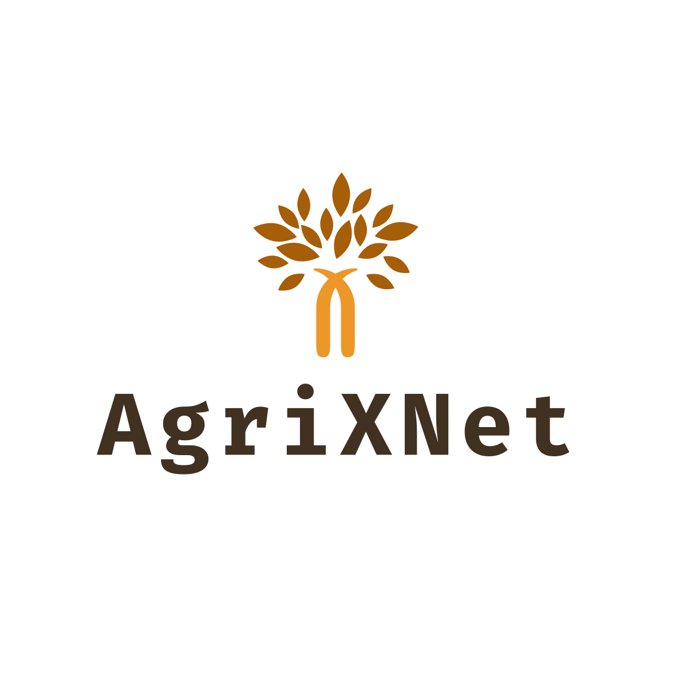

# AgriXNet: An Interpretable Deep Learning System for Crop Disease Prediction and Recommendation



## Overview

**AgriXNet** is a modern, web-based platform that leverages Deep Learning and Explainable AI (XAI) to empower farmers and agronomists with actionable insights for crop disease detection and crop recommendation. The system is designed for transparency, usability, and professional deployment, featuring a beautiful Bootstrap-based UI, persistent chat helpdesk, and advanced XAI visualizations.

---

## Features

- **Crop Recommendation:**  
  Get tailored crop suggestions based on soil nutrients, weather, and environmental data, with interpretable explanations.

- **Disease Prediction:**  
  Upload plant images to detect diseases using a deep learning model, with confidence scores and remedy suggestions.

- **Explainable AI (XAI):**  
  Visualize model decisions using Grad-CAM, LIME, Class Activation Maps (CAM), and Saliency Maps.

- **Chat Helpdesk:**  
  Floating, non-intrusive chat widget for instant support, with avatars, message grouping, sound notifications, and quick replies.

- **User Authentication:**  
  Secure login and registration for personalized experience and persistent chat history.

- **Modern UI/UX:**  
  Responsive, professional design using Poppins/Inter fonts, green/white palette, smooth transitions, and mobile-friendly layouts.

- **Multi-language Support:**  
  Easily switch between English and Hindi.

---

## Demo


---

## Table of Contents

- [Installation](#installation)
- [Usage](#usage)
- [Project Structure](#project-structure)
- [Key Technologies](#key-technologies)
- [Contributing](#contributing)
- [Contact](#contact)
- [License](#license)
- [Credits](#credits)

---

## Installation

### Prerequisites

- Python 3.8+
- pip
- (Optional) virtualenv

### Clone the Repository

```bash
git clone https://github.com/yourusername/agrixnet.git
cd agrixnet
```

### Install Dependencies

```bash
pip install -r requirements.txt
```

### Setup Environment Variables

Create a `.env` file in the root directory and add any required secrets (e.g., Flask secret key, database URI).

```env
FLASK_SECRET_KEY=your_secret_key
DATABASE_URL=sqlite:///agrixnet.db
```

### Run the Application

```bash
flask run
```

The app will be available at [http://localhost:5000](http://localhost:5000).

---

## Usage

### Crop Recommendation

1. Navigate to **Crop Recommendation** from the navbar.
2. Enter soil NPK values, pH, rainfall, temperature, humidity, state, and season.
3. Click **Recommend Crop** to get suggestions and explanations.

### Disease Prediction

1. Go to **Disease Prediction**.
2. Upload a clear image of the plant leaf.
3. View the predicted disease, confidence, and suggested remedies.

### XAI (Explainable AI)

- Access via the **XAI** dropdown in the navbar.
- Choose from **Grad-CAM**, **LIME**, **CAM**, or **Saliency Maps**.
- Upload an image to visualize which parts influenced the model’s decision.

### Chat Helpdesk

- Click the floating chat icon at the bottom right.
- Ask questions or use quick replies for instant help.

---

## Project Structure

```
agrixnet/
│
├── app.py                  # Main Flask application
├── requirements.txt
├── .env
├── static/
│   ├── images/             # Logos, banners, XAI outputs, etc.
│   ├── css/                # Custom stylesheets
│   └── scripts/            # JS scripts
├── templates/
│   ├── layout.html         # Base template
│   ├── crop1.html          # Crop recommendation page
│   ├── disease.html        # Disease prediction page
│   ├── gradcam.html        # Grad-CAM XAI page
│   ├── lime.html           # LIME XAI page
│   ├── cam.html            # CAM XAI page
│   ├── saliency.html       # Saliency XAI page
│   └── ...                 # Other templates
├── utils/
│   ├── xai.py              # XAI backend functions (GradCAM, CAM, Saliency)
│   └── ...                 # Other utilities
└── README.md
```

---

## Key Technologies

- **Backend:** Python, Flask
- **Frontend:** Bootstrap 4, HTML5, CSS3, JavaScript
- **AI/ML:** TensorFlow/Keras or PyTorch (for models), scikit-learn
- **XAI:** Grad-CAM, LIME, CAM, Saliency Maps
- **Database:** SQLite (default), can be configured for PostgreSQL/MySQL
- **Other:** FontAwesome, Emoji-mart, jQuery

---

## Contributing

We welcome contributions! To contribute:

1. Fork the repository.
2. Create a new branch (`git checkout -b feature/your-feature`).
3. Commit your changes (`git commit -am 'Add new feature'`).
4. Push to the branch (`git push origin feature/your-feature`).
5. Open a Pull Request.

Please follow the existing code style and include tests where appropriate.

---

## Contact

- **Rohin Sabharwal:** [rohinsabharwal88@gmail.com](mailto:rohinsabharwal88@gmail.com)
- **Sachit Sharma:** [sachitsharma@gmail.com](mailto:sachitsharma@gmail.com)
- **Mehul Kalra:** [mehulkalra@gmail.com](mailto:mehulkalra@gmail.com)

For issues, please use the [GitHub Issues](https://github.com/yourusername/agrixnet/issues) page.

---

## License

This project is licensed under the MIT License. See [LICENSE](LICENSE) for details.

---

## Credits

**Contributors:**  
- Rohin Sabharwal  
- Sachit Sharma   
- Mehul Kalra 

**Special Thanks:**  
- All contributors and the open-source community.

---

**AgriXNet** – Harnessing Interpretable AI for Smarter Farming.

---
